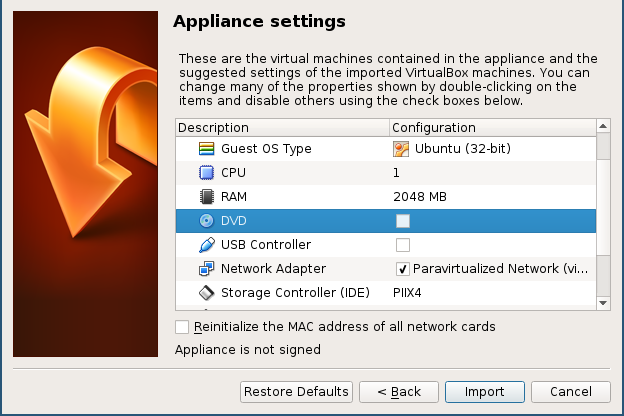
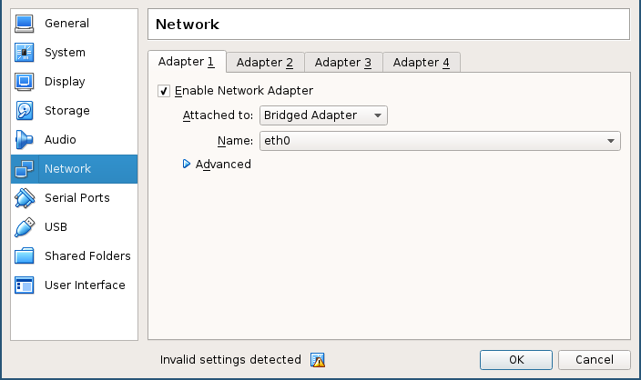
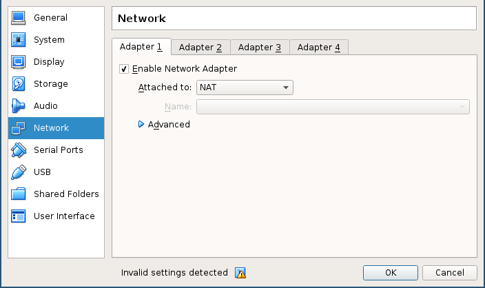
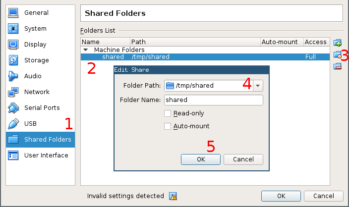
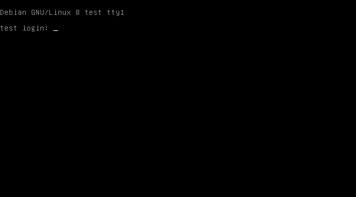
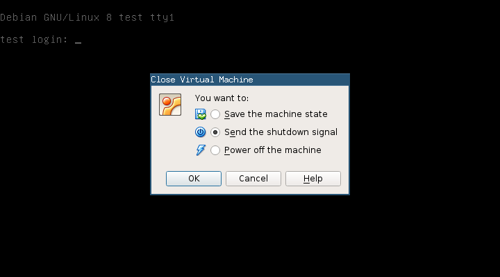
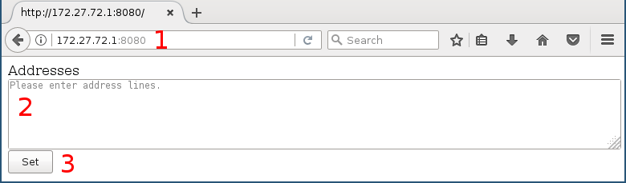
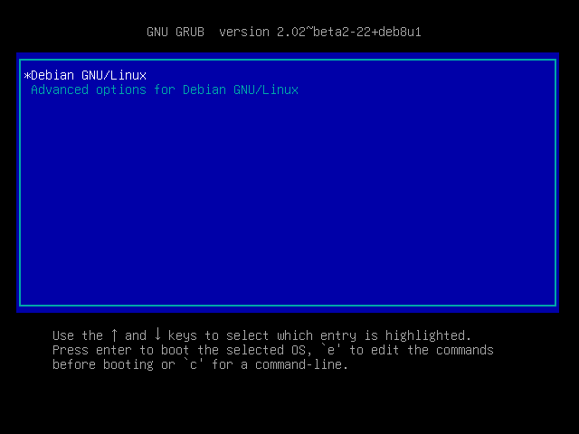
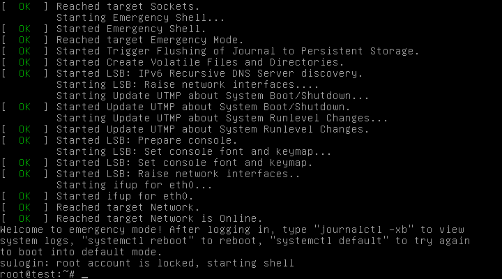

---
title: Running a testbed virtual node
...

## Introduction

Welcome to the [CENO](https://censorship.no/) network measurement project!

This initiative attempts to measure network filtering around you.  Your
computer *node* will participate in a group running a series of network tests
covering different connectivity scenarios with servers in censorship-free
zones and other nodes running similar tests in the same potentially censored
zone.  Normal client-server as well as peer-to-peer communication protocols
are used to compare how all of the nodes will behave and detect possible
interference (like traffic throttling or filtering).  Below you will find a
[list of applications](#appendix-summary-of-applications-running-on-your-node)
that your node will be running.

Should you have any questions please write to us at <testingceno@gmail.com>,
and please include:

  - Your IP address: go to <https://whatismyip.net/> or ask "what is my ip
    address" to your Internet search engine (Google, DuckDuckGo…).

  - Your node ID: a string of 36 digits, letters and dashes which will appear
    in the file ``id.txt`` under your shared folder (see below) or after
    ``NODE``  in the VM screen (press enter if you can not see it).  If the
    node ID is not yet there, please wait for an hour or two and check again.

The instructions within will help you install and run a virtual Linux computer
(or *virtual machine* — VM) that will perform the aforementioned network
experiments.  The VM safely does so without access to your computer's files,
with very little impact on your system installation and keeping resource usage
constrained.

We recommend that you run the VM in a desktop or laptop PC connected to the
Internet via an Ethernet cable (Wi-Fi is also supported but discouraged).
Experiments also benefit from the VM running continuously, if possible.
Measurement results are periodically sent to our servers, but in case there
are problems, the VM will leave test results in a *shared folder* (see below)
so that you can send them to us manually.

**IMPORTANT NOTE:** In the current implementation, a running testbed node may
generate a **network traffic of 5-10 gigabytes a month**.  If this may cause
you to hit a data cap or incur high connectivity costs, please do not run a
node.  The CENO project disclaims any responsibility on the costs or
consequences of running a node voluntarily.

## Requirements

 1. You will need an **x86 PC or laptop** (the most common Intel or AMD-based
    ones) with the following features:

      - At least 2 gigabytes of RAM and from 2 to 8 gigabytes of free disk
        (hard disk usage may grow with time to a limit of 8 gigabytes).

      - Windows, macOS or GNU/Linux operating system.

      - A 64-bit CPU with hardware virtualization support, although this is
        not strictly required.

 2. You will need the **VirtualBox** virtualization platform:

      - For Windows and macOS you may download and install the software
        package by following the appropriate link in
        <https://www.virtualbox.org/wiki/Downloads> under the section
        *VirtualBox binaries*, *VirtualBox platform package* (the Extension
        Pack and Developer Kit are not needed).

      - For Linux you may visit
        <https://www.virtualbox.org/wiki/Linux_Downloads> or install the
        packages already provided by your operating system (via the *Ubuntu
        Software* tool, *Synaptic* or similar).

 3. You will need the ``test.ova`` **virtual machine image**.  Copy it to some
    folder in your computer.

 4. You will also need to **create an empty folder** called ``shared`` (with
    all characters in *lower case*) in your computer.

## Importing the VM image

 1. Open VirtualBox.
 2. Select *File / Import Appliance…* in the menu, then in the dialog that
    follows click on the small folder icon next to the text box.  Select the
    ``test.ova`` file that you copied to your computer and click on *Next >*.
 3. In the *Appliance settings* dialog that follows, you may lower the amount
    of *RAM* from ``2048 MB`` (recommended) to ``1024 MB`` or even ``512 MB``
    if your PC has 2 gigabytes of RAM or less.

    You may also deselect *DVD* and *USB Controller*.  Then click on *Import*.

    

 4. Click with the right button on the newly created machine (called ``test``)
    and select *Settings…*.

 5. Choose the *Network* icon in the settings window and the *Adapter 1* tab,
    then:

      - If your PC connects to the network via Ethernet cable (recommended),
        select *Attached to: Bridge Adapter* and in *Name:* choose your
        network card (usually ``eth0`` or ``en<something>`` in Linux and
        macOS, and ``Local Area Connection`` in Windows).

        

      - If your PC connects to the network via Wi-Fi, select *Attached to:
        NAT*.  You will not be able to access the Tor bridges web form
        described [further below](#setting-new-tor-bridges) (which is not
        critical).

        

 6. Choose the *Shared Folders* icon in the settings window, then the
    ``shared`` entry under *Folders List* and click on the edit button (the
    folder with the orange ball) on the right.  In the dialog that follows,
    click on the drop down list in the *Folder Path* box, then on *Other…* and
    choose the ``shared``  folder that you created at the beginning (the path
    in your PC will probably differ from that in the picture).  Finally click
    on *OK* in the dialog.

    

 7. Accept the new configuration (do not worry about the warning on invalid
    settings at the bottom of the settings window).

## Starting the VM

 1. Open VirtualBox if not yet running.
 2. Click with the right button on the machine called ``test`` and select
    *Start / Normal Start*.  A new window will open with the VM screen.
 3. Do not click on any key.  After a few minutes you will see a black screen
    like this:

    

    This means that the VM has started properly.  You may minimize the VM
    screen window and it will continue to run.  Future boots may take
    considerably shorter times.

If everything went fine you may remove the ``test.ova`` file from your
computer.  Otherwise, if you find any issues while starting the VM, see
[Troubleshooting](#troubleshooting).

## Stopping the VM

You may stop the VM at any time, but for better test results we recommend that
you leave it running.  If you must shutdown or suspend the PC, we recomment
that you stop the VM first, as this may cause problems with the VM clock.

To stop the VM, select the VM screen window and select *File / Close…* in its
menu, then in the dialog that follows select *Send the shutdown signal* and
click on *OK*.  After a few seconds the VM screen window will close.

## Removing the VM

 1. Open VirtualBox if the VM is not running.  If it is running, first stop it
    as described [above](#stopping-the-vm).
 2. Click with the right button on the machine called ``test`` and select
    *Remove…*.
 3. In the dialog that follows, click on *Delete all files* to remove both the
    VM entry and its disk image.
 4. You will still need to manually remove the ``shared`` folder that you
    created at the beginning.

## Setting new Tor bridges

**NOTE:** This feature will not work if your PC connects to the newtork via
Wi-Fi and you chose *Attached to: NAT* for the VM's network connection (see
network settings [further above](#importing-the-vm-image)).

The VM uses the Tor network to facilitate management.  If there are issues
with connecting to the Tor network from your own network, you may want to
configure new **Tor bridges** in the VM.  This can be done via a very simple
**web form** available at <http://172.27.72.1:8080/>.  The VM always enables
this address in its virtual network interface card, but you will need to add
an additional address to your PC to reach it:

  - In Windows, if ``Local Area Connection`` is your Ethernet interface, open
    the command line interpreter and run:

        netsh interface ip add address "Local Area Connection" 172.27.72.2 255.255.255.0

  - In macOS, if ``en0`` is your Ethernet interface, open a terminal and run:

        sudo ifconfig en0 alias 172.27.72.2 255.255.255.0

  - In GNU/Linux, if ``eth0`` is your Ethernet interface, open a terminal and
    run:

        sudo ip addr add 172.27.72.2/24 dev eth0

To set the Tor bridges:

 1. Retrieve a list of bridges, e.g. by copying the list of bridge lines as
    provided by <https://bridges.torproject.org/>.
 2. Add the address ``172.27.72.2`` to your Ethernet interface as indicated
    just above.
 3. Open <http://172.27.72.1:8080/> in your browser.  You will see a form with
    a text box and a button.  Paste the bridge lines in the text box, then
    click on *Set*.

    

    If you provide no bridge lines, use of Tor bridges in the VM will be
    disabled.
 4. After a few seconds the Tor connection should be restablished.

## Troubleshooting

### Boot stuck in blue menu screen or black GRUB prompt

If you happen to hit some key while the blue VM screen is on, you just need to
use the Up/Down keys in your keyboard until the ``Debian GNU/Linux`` entry is
highlighted and press Enter.  If you get a blank screen with a ``grub>``
prompt, first press Escape then follow the instructions above.

### Emergency mode shell on boot

If the VM boots and you get a screen like this one:

It probably means that the shared folder is missing in your PC or that it is
not configured correctly.  First of all, type ``poweroff`` then Enter at the
VM screen for it to shut down, then check the VM's *Shared Folders* settings
to see if the *Folder Path* corresponds to an existing folder and that its
*Name* is ``shared``.

## Appendix: Summary of applications running on your node

  - Tor (permanent): without bridges by default, but you can can
    [configure them](#setting-new-tor-bridges)
  - OnionCat (uses Tor actually, so no extra traffic)
  - cjdns (in active testbeds): a VPN with encrypted/authenticated UDP traffic
    from a port that depends on the VM towards port that depends on the server
  - OpenVPN (for short periods): towards server TCP port 443
  - SSH (for short periods): towards server TCP port 22 (for PPP)
  - SSL (for short periods): towards server TCP port 443 (for PPP)
  - TCP: (submitting HTTP server port number): towards server TCP port 57007
  - HTTP (from a peer): downloading a random file towards a peer random TCP port
  - TLS (submitting report to the backend): towards server TCP port 11443
    (could be 443 if we prefer)
  - BitTorrent (for short periods): downloading a harmless, public file from
    other peers sharing it, using random UDP ports
